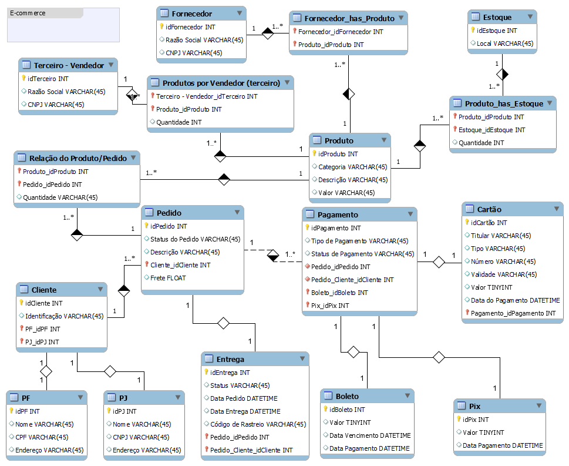

# 📂 Desafio DIO

## 📃 Refinando um Projeto Conceitual de Banco de Dados de E-COMMERCE

 

## 🚀 Tecnologias

- SQL
- MySQL Workbench

 

## 💻 Projeto
> Diagrama do Banco de Dados 📸

  

 

✓ Cliente PJ e PF – Uma conta pode ser PJ ou PF, mas não pode ter as duas informações;
✓ Pagamento – Pode ter cadastrado mais de uma forma de pagamento;
✓ Entrega – Possui status e código de rastreio;

---
---
## 📧 Contato
[LinkedIn](https://www.linkedin.com/in/wsawebmaster/)

wsawebmaster@yahoo.com.br
